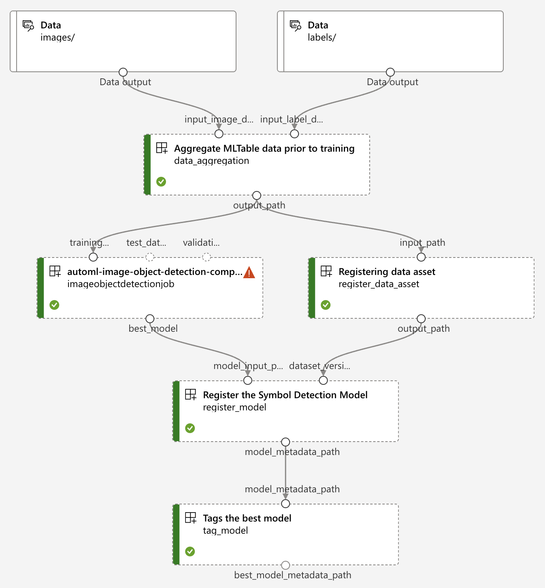

# AML Pipeline Modules Overview

## Pipeline Overview

An [Azure Machine Learning pipeline](https://learn.microsoft.com/en-us/azure/machine-learning/concept-ml-pipelines?view=azureml-api-2) is a tool that enables machine learning scientists to create, manage, and execute end-to-end machine learning workflows. It allows the creation of automated workflows that orchestrate machine learning tasks.

In this symbol detection pipeline, there are six main steps:

1. **Data Aggregation:** This step involves aggregating the data required for training the machine learning model.

1. **Data Split:** This step splits data to training and validation sets prior to training.

1. **Register Data Asset:** This step registers the aggregated data as a new version of the training data asset.

1. **Training the Machine Learning Model:** In this step, the machine learning model is trained using the aggregated data.

1. **Registering the Model:** After a model has been trained, it is necessary to register it by creating an artifact that can be used for deployment.

1. **Tagging the Model:** Finally, the best performing model is tagged so that it can be easily identified and used for future tasks.

By following these steps, the symbol detection pipeline can effectively automate the machine learning workflow, leading to efficient and effective results.

## Pre-Requisites for AML Pipeline

Once the Azure Machine Learning workspace is created, there are two required steps and one optional step to prepare the AML pipeline for continuous deployment:

1. ### CPU and GPU Compute (Required)

    Azure ML compute provides dedicated compute resources to run any job submitted to an AML workspace. In this project, we use compute clusters, which are Azure-managed compute infrastructure resources that can be single or multi-node. The VM tier, type, and size can be specified at creation time and can be put into a Virtual Network to comply with any secure networking requirements.

    For this pipeline, we have decided] to provision both a CPU and a GPU compute cluster. The GPU cluster is required for training the image object detection model, and the CPU cluster will be the fallback compute for the other less compute-intensive jobs.

    Compute clusters will be created and managed via [Terraform](https://registry.terraform.io/providers/hashicorp/azurerm/latest/docs/resources/machine_learning_compute_cluster).

1. ### Data Loader Module for Synthetic Image Set (Required)

    Synthetic images used by this pipeline will be stored as a zip file in a shared storage account that is accessible to all customers. You can find a collection of sample image files in this [location](https://drive.google.com/drive/u/0/folders/1gMm_YKBZtXB3qUKUpI-LF1HE_MgzwfeR) for the initial setup, source: [Digitize-PID: Automatic Digitization of Piping and Instrumentation Diagrams](https://arxiv.org/abs/2109.03794#:~:text=Digitization%20of%20scanned%20Piping%20and%20Instrumentation%20diagrams%20%28P%26ID%29%2C,that%20are%20compatible%20with%20the%20latest%20CAD%20tools). The zip file will contain all JPEG images along with their corresponding label data in npy format. However, the pipeline requires the label data to be in jsonl format. To address this, the synthetic image module uploads all synthetic images along with their labels in npy format and converts all npy files into a single jsonl file. This module will be integrated with Terraform and needs to be executed only once before running the pipeline, preparing all synthetic images and their labels in a datastore within the AML workflow.

    **Input**

    **Input parameters/arguments** required:

    - `raw-blob-sas-url`: the SAS url for the zip file
    - `raw-input-path`: a location to store the zip file after downloading from the storage account
    - `image-output-path`: the location of image set in AML datastore (data/images)
    - `label-output-path`: the location of label set in AML datastore (data/labels)

    **Environment variables** required:

    - `STORAGE_ACCOUNT_CONNECTION_STRING`: the connection string for Azure storage account associated with the AML datastore.
    - `STORAGE_ACCOUNT_CONTAINER_NAME`: the container name that all images and labels will be stored:

    **NOTE**:
    Any new images with the labels in jsonl format can be appended in the respective folders of the AML datastore. The pipeline will then pick up the new images with their labels and execute its steps as per the designed workflow.

    **Execution**

    This task can be executed locally from **VS Code** by providing all input variables through `Python: Unzip & Upload local files` in the **VS Code** launch script. For this step, `az login` command can be used to authenticate with Azure to access to the storage account containing the zip file and other resources.

## AML Pipeline Steps

1. ### Data Aggregation step

    The data aggregation component is the first step of the AML pipeline.
    It transforms the stored image and label datasets into a format that the AutoML training job can consume.
    It does so by aggregating the individual label jsonl files for each image into a a single jsonl file and then generate a new MLTable file. While doing so it also ensures that the absolute path to the image, not just the filename, is set as its `image_url`.

    **Inputs**

    **Input parameters/arguments** required:

    - `input-image-data-path`: the storage path of the image data to mount
    - `input-label-data-path`: the storage path of the label data to mount
    - `input-images-string-absolute-path`: the absolute path to the AML image dataset (of the format`"azureml://subscriptions/{config.subscription_id}/resourcegroups/{config.resource_group_name}/workspaces/{config.workspace_name}/datastores/workspaceblobstore/paths/{images or other directory name}"`)
    - `output_path`: the output path of the aggregated MLTable. Note that this doesn't need to be explicitly specified when submitting the Azure ML job - AML will output to an arbitrary attached storage location that the next training step can access via this property.

    **Environment variables** required:

    - `PIPELINE_CPU_COMPUTE_NAME`: the CPU compute cluster used to run this component
    - `INPUT_IMAGE_DATA_PATH`: maps to `input-image-data-path` (as type `uri_folder`) and `input-images-string-absolute-path` (as type `string`)
    - `INPUT_LABEL_DATA_PATH`: maps to `input-label-data-path` (as type `uri_folder`)

    **Execution**

    This task can be executed locally from **VS Code** by providing all input variables through `Python: Pipeline Step - Data Aggregation` in the **VS Code** launch script.

1. ### Data Split step

    This step split the dataset from "Data Aggregation" step into tranining and validation dataset as MLtable. If `use_stratified_split` is set to `False`, there is no splitting conducted and the dataset from "Data Aggregation" step will used for later stage.

    **Inputs**

    **Input parameters/arguments** required:

    - `input_data_path`: the storage path of aggregated mltable to mount
    - `use_stratified_split`: boolean value indicates whether the splitting should be conducted 
    - `stratified_split_n_fold`: `k`-folded to be used for splitting;  only a single fold is utilized in the rest of the pipeline
    - `mandatory_train_filenames`: list of files to be forced to assign to traning dataset
    - `mandatory_val_filenames`: list of files to be forced to assign to validation dataset
    - `output_path.train_output_path`: the output path of the splitted tranining dataset
    - `output_path.val_output_path`: the output path of the splitted validation dataset

    **Environment variables** required:
    - `USE_STRATIFIED_SPLIT`: maps to `use_stratified_split` (as type `boolean`)
    - `STRATIFIED_SPLIT_N_FOLD`: maps to `stratified_split_n_fold` (as type `integer`)
    - `MANDATORY_TRAIN_FILENAMES`: maps to `mandatory_train_filenames` (as type `string`) 
    - `MANDATORY_VAL_FILENAMES`: maps to `mandatory_val_filenames` (as type `string`) 

    **Execution**

    This task can be executed locally from **VS Code** by providing all input variables through `Python: Pipeline Step - Data Split` in the **VS Code** launch script.

1. ### Register Data Asset step

    This step first uploads the aggregated MLTable file to the AML datastore and then registers it as a dataset in the AML workspace. After the registeration, the data asset url in the AML standard format is returned to the register model step.

    **Inputs**

    **Input parameters/arguments** required:

    - `train-input-path`: the storage path of the training MLTable file
    - `val-input-path`: the storage path of the training MLTable file
    - `data_store_name`: data store name to register data asset.
    - `output_path`: the output path of the registered data asset. Note that this doesn't need to be explicitly specified when submitting the Azure ML job - AML will output to an arbitrary attached storage location that the next training step can access via this property.

    **Execution**

    This task can be executed locally from **VS Code** by providing all input variables through `Python: Pipeline Step - Registering Data Asset` in the **VS Code** launch script.

1. ### Train Model step

    AutoML uses the input data asset registered to train the object detection model. It provides a range of models such as YOLOv5 and Faster R-CNN. During the training process, it uses techniques such as transfer learning and hyperparameter optimization to ensure that the model is optimized.

    **Inputs**

    **Input parameters/arguments** required:

    - `input-data-asset`: data asset,
    - `target-column-name`: column name,
    - `validation-data-size`: training and validation data split ratio,
    - `primary-metric`: mean_average_precision is the suggested metric for best model selection,

    **Environment variables** required:

    - `TRAINING_JOB_TIMEOUT_MINUTES`, default value is 180
    - `TRAINING_MAX_TRIALS`, default value is 8,
    - `TRAINING_CONCURRENT_TRIALS`, default value is 4
    - `TRAINING_VALIDATION_DATA_SIZE`, default value is 0.2
    - `PIPELINE_CPU_COMPUTE_NAME`,default value is gpu-cluster
    - `TRAINING_GPU_COMPUTE_NAME`, default value is cpu-cluster
    - `TRAIN_DATASET`, the blob path for the training dataset used in the pipeline, an example of the value is "azureml://datastores/workspaceblobstore/paths/training-sets/718a123e-994d-4e52-a472-3989eb7bd620/train", default value is None
    - `VAL_DATASET`, the blob path for the validation dataset used in the pipeline, an example of the value is "azureml://datastores/workspaceblobstore/paths/training-sets/718a123e-994d-4e52-a472-3989eb7bd620/train", default value is None
    - `DATASET_VERSION_PATH`, the blob path for dataset version file created for the datasets of `TRAIN_DATASET` and `VAL_DATASET` if previousy created datasets are used, an example of the value is "azureml://datastores/workspaceblobstore/paths/azureml/5d5c47eb-ee52-4c00-8cec-115df1d595b8/output_path", default value is None
    - `AUTO_MODE`, use automode for hyper-parameter tuning, search space specified in `src/app/automl_pipeline/mlops/config_search_space.yml` (please refer to https://learn.microsoft.com/en-us/azure/machine-learning/how-to-auto-train-image-models?view=azureml-api-2&tabs=cli#manually-sweeping-model-hyperparameters for details on search space definition) will be used for define the search space during hyper-parameter tuning if set False, default value is True. The hyperparameters that can be adjusted are specified in the file  `src/app/automl_pipeline/mlops/object_detection_search_space.py`

    Auto ML picks a final model based on the primary metric configured.

    **Execution**

    This task also can be executed from **VS Code** by providing all input variables through `Python: Pipeline Setup` in the **VS Code** launch script. For this step, `az login` command can be used to authenticate with Azure to access the AML workspace.

1. ### Register Model step

    Registers a model from an existing training job (or run id) into the Azure ML workspace. If a model already exists, it will increment its version.

    This pipeline step also outputs a metamodel file that includes the model base name, version and metrics (mean average precision, recall and precision) of the specified model.

    **Inputs**

    **Input parameters/arguments** required:

    - `model-base-name`: The model name to register into AZ ML Workspace
    - `model-input-path`: The training path artifacts. Among them, it should contain the `MLModel` file (from MLFlow model)
    - `model-metadata-path`: The output path for the registration artifacts (as type `uri_folder`)

    **Environment variables** required:

    - `PIPELINE_CPU_COMPUTE_NAME`: the CPU compute cluster used to run this component (as type `string`)
    - `MODEL_BASE_NAME`: maps to `model-base-name` (as type `string`)

    **Execution**

    This task can be executed locally from **VS Code** by providing all input variables through `Python: Pipeline Step - Register Model` in the **VS Code** launch script. For this step, `az login` command can be used to authenticate with Azure to access the AML workspace. Make sure to update the file `src/app/sample_artifacts/register/MLmodel.sample` with the RUN_ID that matches that of the completed training job.

1. ### Tag Model step

    Compares the current best model & new model to determine which one has a better mean average precision (mAP); it then tags that result as "best_model". This model will then be deployed to an endpoint for the inferencing service to consume.

    You can expect an update to the "best_model" as "true" tag once the new best model has been chosen. Also, a metadata file that includes the version selected is stored.

    **Inputs**

    **Input parameters/arguments** required:

    - `model-base-name`: The model name to register into AZ ML Workspace
    - `model-metadata-path`: The registration path artifacts. Among them, it should contain the `model_metadata` file
    - `best-model-metadata-path`: The tag artifacts path (output)

    **Environment variables** required:

    - `PIPELINE_CPU_COMPUTE_NAME`: the CPU compute cluster used to run this component (as type `string`)
    - `MODEL_BASE_NAME`: maps to `model-base-name` (as type `string`)

    **Execution**

    This task can be executed locally from **VS Code** by providing all input variables through `Python: Pipeline Step - Tag Model` in the **VS Code** launch script. For this step, `az login` command can be used to authenticate with Azure to access the AML workspace. Make sure to update the file `src/app/sample_artifacts/tag/model_metadata.json.sample` included in `sample_artifacts` directory setting the model name and its version to compare against the "best_model".
