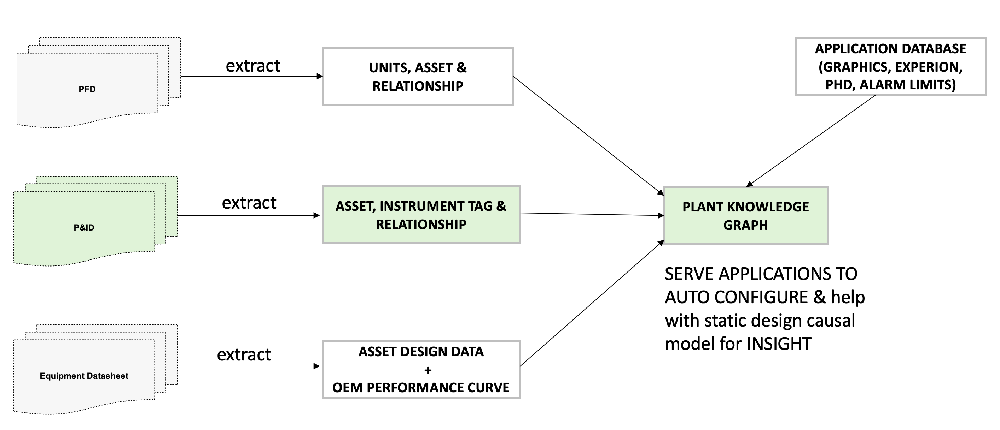

# Engineering Document (P&ID) Digitization

## Introduction

TODO

### What is an engineering document?

Engineering documents are a critical component in th field of engineering, serving as the blueprint for the design, construction, and operation of industrial plants.
They encompass a wide range of formats and types, each with its specific purpose and use in different stages of an engineering project.

#### P&ID

One of the most common types of engineering documents is the Piping and Instrumentation Diagram (P&ID). A P&ID is a detailed graphical representation of a process system within a plant. It illustrates the piping, process equipment, and instrumentation control devices in the system. These diagrams are created during the design stage of a process and are typically stored in an image or PDF format.

P&IDs are widely used in manufacturing industries. They contain valuable information about the layout and operation of a plant, including details about pipes, symbols, and textual information.

Figure 1. P&ID that displays key elements. Symbols (1), text (2), lines / connections (3) and flow arrows (4).

### Why digitize engineering documents?

In the world of engineering, the design of an industrial plant is delivered as a set of key documents. These documents serve as the foundation upon which enterprise digital transformation companies configure their services to deliver outcomes. However, the current process presents several challenges:

#### Challenges

##### Manual Process

The configuration of assets, tags, and relationships is currently done manually by application engineers. This manual process is not only time-consuming but also prone to errors.

##### Slow Customer Onboarding

The manual process results in a slow customer onboarding experience. The time to value is significantly longer due to the time it takes to manually configure everything from the engineering design documents into applications.

###### Expensive Rework

Errors in mapping configuration from engineering design documents into applications lead to rework. The cost of this rework is high, making the process expensive and inefficient.

#### Solution

To overcome these challenges, there is a need to digitize engineering documents into a knowledge graph. This digital transformation will streamline the process, reduce errors, speed up customer onboarding, and ultimately save costs by reducing expensive rework.

Figure 2. Extract information from engineering documents to ingest into knowledge graph.

We are excited to introduce a cutting-edge, comprehensive solution for the digitization of P&ID sheets, powered by Azure’s computer vision and deep learning capabilities. This innovative approach integrates image-processing techniques to tackle challenging low-level vision tasks such as line detection, along with a deep learning pipeline for symbol detection and recognition.

For training and evaluation, we utilize a synthetic dataset of P&ID sheets known as Dataset-P&ID [(can be found in the research paper)](https://arxiv.org/pdf/2109.03794.pdf). This dataset comprises 500 P&ID sheets along with corresponding annotations. This dataset is released online for public use.

## Methodology

### Detection

In the context of P&ID diagrams, detection involves the process of identifying and locating specific elements within the diagram. These elements include the key elements of a diagram: symbols, text, and lines.

#### Symbol Detection Module

The P&ID diagram will be pre-processed by filtering techniques and then we will apply the object detection model with [AutoML](https://learn.microsoft.com/en-us/azure/machine-learning/concept-automated-ml?view=azureml-api-2) to detect the trained symbols and provide bounding boxes for the detected symbols. The model will group the symbols into 3 categories: equipment, piping and instrumentation which are the key components of the graph.

See full symbol categorisation [here](https://github.com/Azure-Samples/MLOpsManufacturing/blob/main/samples/amlv2_pid_symbol_detection_train/docs/symbols_nomenclature_hirerarchy.md).

[ADD RESULT IMAGE]

#### Text Detection Module

The P&ID diagram will be pre-processed by filtering techniques and the prior symbol detected information will be used to detect the text using [Azure AI Document Intelligence](https://learn.microsoft.com/en-us/azure/ai-services/document-intelligence/overview?view=doc-intel-3.0.0) for a higher accuracy. This step will extract the text and the bounding box co-ordinates where the text is present.

[ADD RESULT IMAGE]

#### Line Detection Module

The P&ID diagram will be pre-processed by applying thinning and filtering techniques. Symbol detected information and text detected information will then be used to detect the lines using image processing techniques (Hough transform). The detected lines will be used to determine connection and connection direction between the detected symbols.

[ADD RESULT IMAGE]

## Comprehension

TODO

### Graph Construction

TODO

### Graph Traversal

TODO

### Graph Persistence

TODO

## End-to-end Digitization Architecture for P&IDs

- Symbol Detection Model repo
	○ Benefits such as trained to recognize 50+ symbols on pids, automated training pipeline, managed endpoint
	○ Link to architecture repo
- Link to WebAPI architecture repo
	○ Link to architecutre repo

## Summary

Invite community to use our solution (2 repos)

Contributions to:
- Paper with 500 image/label dataset:  [Digitize-PID: Automatic Digitization of Piping and Instrumentation Diagrams](https://arxiv.org/pdf/2109.03794.pdf)
- Paper with detection process: [Digitization of chemical process flow diagrams using deep convolutional neural networks](https://www.sciencedirect.com/science/article/pii/S2772508122000631)