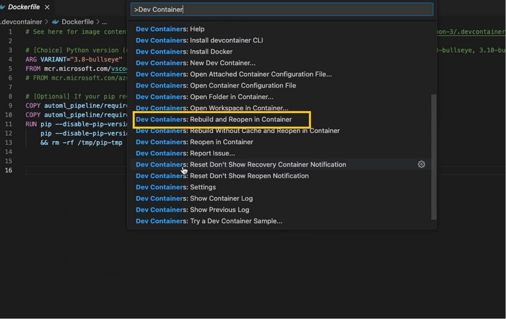
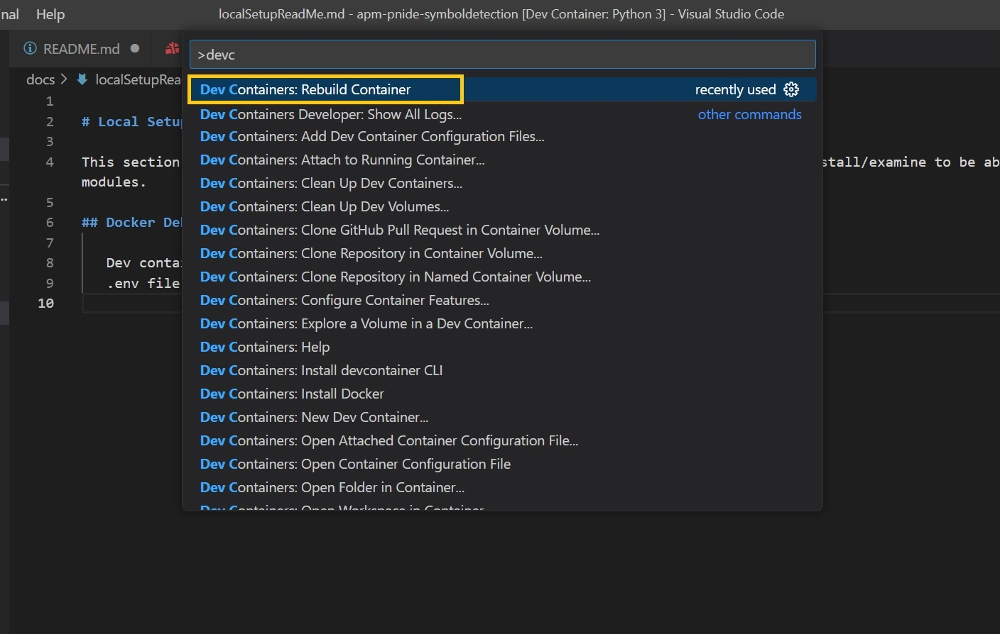
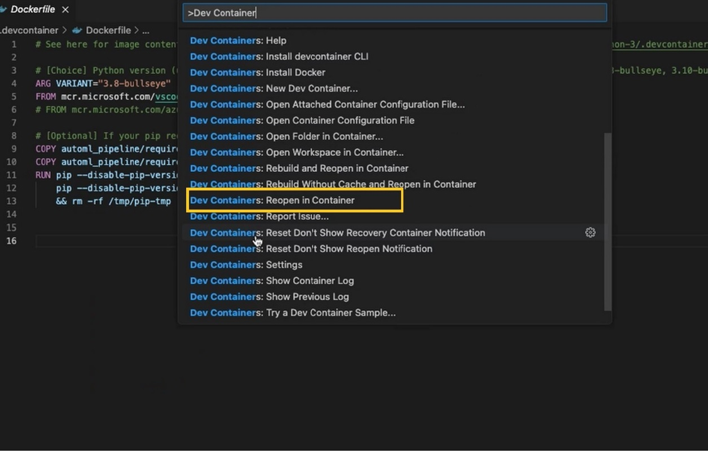
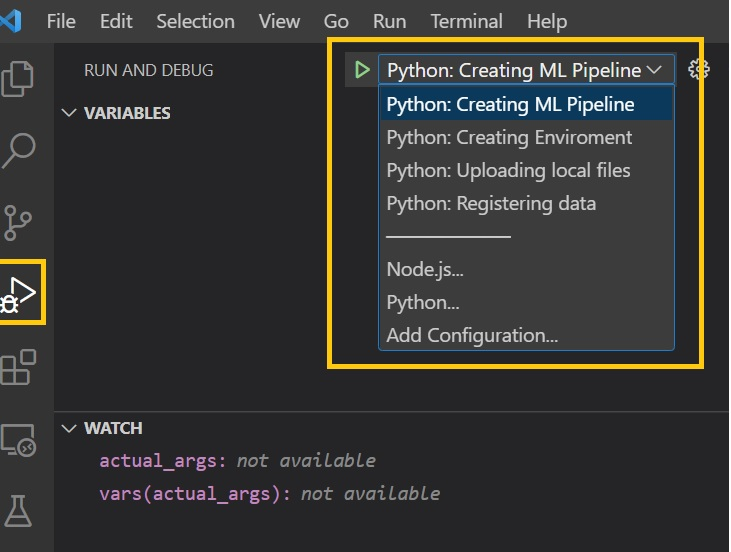
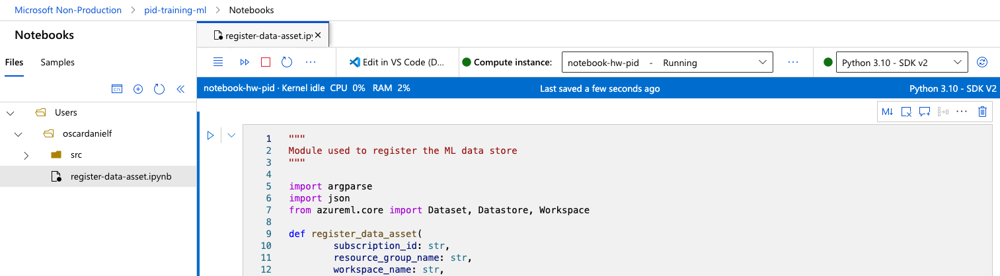

# Local Development Setup

This section will provide information on the installations/extensions that developers will need to install/examine to be able to run/debug the python modules for the repo. Here, we assume that Visual studio code will be used as development IDE.

## Table of contents

1. [Docker Desktop](#docker-desktop)
1. [Dev container VS code extensions](#dev-container-vs-code-extensions)
1. [Dev container setup](#what-is-needed-to-set-up-the-dev-container)
1. [Run/Debug in VS code](#running-the-code-in-vs-code)

### Docker Desktop

1. Install [Docker Desktop](https://www.docker.com) specific to the machine that will be used for coding.
1. Once the install is complete it may need a machine restart.
1. Open docker desktop and make sure it runs fine.

### Dev container VS code extensions

The Visual Studio Code Dev Containers extension lets developers use a Docker container as a full-featured development environment. It allows devs to open any folder or repository inside a container and take advantage of Visual Studio Code's full feature set

1. In Visual studio code extensions, search for **"Dev Containers"** and install it (extension id `ms-vscode-remote.remote-containers`).
1. In Visual studio code extensions, search for **"Docker"** and install it (extension id `ms-azuretools.vscode-docker`).

### What is needed to set up the dev container?

To create a development (dev) container in VS Code 2 files are to be configured and the code repository should have default ones provided to get started:

1. **devcontainer.json** defines how VS Code should start the container and what to do after it connects.
1. To make and persist changes to the dev container, such as installation of new software, **Dockerfile** will be used.

### Running the code in VS code

1. Run **Docker desktop**.
1. Clone this required repository and open it in VS code.
1. When opening the code for first time, the dev container has to be built using **"Dev Containers: Rebuild and Reopen in Container"** command. This command will build the container image with the required packages from the config files discussed earlier. This would take few mins.

1. When editing the contents of the .devcontainer folder, developers need to rebuild for changes to take effect. Use the **"Dev Containers: Rebuild Container"** command from VS code command palette for your container to update. For everything else **"Dev Containers: Reopen Container"** should be used.


1. **.env** file has to be created with the necessary resources information when setting up the environment for first time, **.env.sample** file provided in the repo provides the list of resources needed for the modules to run based of which the .env file can be created.
1. **launch.json** in .vscode folder has the default configurations to be able to run/debug the independent python modules in the project. The file can be customised as needed during the implementation.
1. Debugging can be done via VS code's **"Run and Debug"**. All the python modules listed in **launch.json** will be listed to be selected for running or debugging.


#### Running issues for Mac M1/M2 Users

When running the code in VS Code, you may get dependency errors as the following:

```bash
ModuleNotFoundError: No module named 'azureml'
```

Even if you re-install this dependency `pip install azureml-sdk`, you may continue experiencing compiler issues due to Apple Silicon chips lack of compatibility. There are a few issues reported in GitHub without an official solution:

- [ImportError: Missing required package "azureml-dataset-runtime" #1797](https://github.com/Azure/MachineLearningNotebooks/issues/1797)
- [Support azureml-pipeline-steps on M1 Mac #23538](https://github.com/Azure/azure-sdk-for-python/issues/23538)

An alternative solution is to run your code on [Jupyter Notebooks](https://learn.microsoft.com/en-us/azure/machine-learning/how-to-run-jupyter-notebooks?view=azureml-api-2). To create a Jupyter Notebook environment in your AZ ML Workspace:

1. Go to your Azure ML Workspace > Notebooks
1. Create a new jupyter notebook under your user (i.e. `Users/<username>/src/register-data-asset.ipynb`)
1. Copy the script content into a cell
1. Make the following updates:
    - Comment the import `from automl_pipeline.config import config`
    - Comment the line `args = get_args()`
    - Update the main function parameters (see example below)
1. Connect to an Azure ML Compute
1. Run the cell



Here is an example for `Python: Registering data asset` after updating the parameters:

```python
# from automl_pipeline.config import config
...

if __name__ == '__main__':
    #args = get_args()

    SUBSCRIPTION_ID = "88e95096-b275-4fb0-be07-a309aa0e98f1"
    RESOURCE_GROUP_NAME = "automl-pipeline-rg"
    WORKSPACE_NAME = "pid-training-ml"
    DATA_STORE_NAME = "pids"
    DATA_ASSET_NAME = "pids-r"
    DATA_ASSET_DESCRIPTION = "description for the asset registration"
    CREATE_NEW_VERSION = False
    TAGS = { "dataones": "images", "datetwos": "labels"}

    register_data_asset(
        SUBSCRIPTION_ID,
        RESOURCE_GROUP_NAME,
        WORKSPACE_NAME,
        DATA_STORE_NAME,
        DATA_ASSET_NAME,
        DATA_ASSET_DESCRIPTION,
        CREATE_NEW_VERSION,
        TAGS
    )
```
