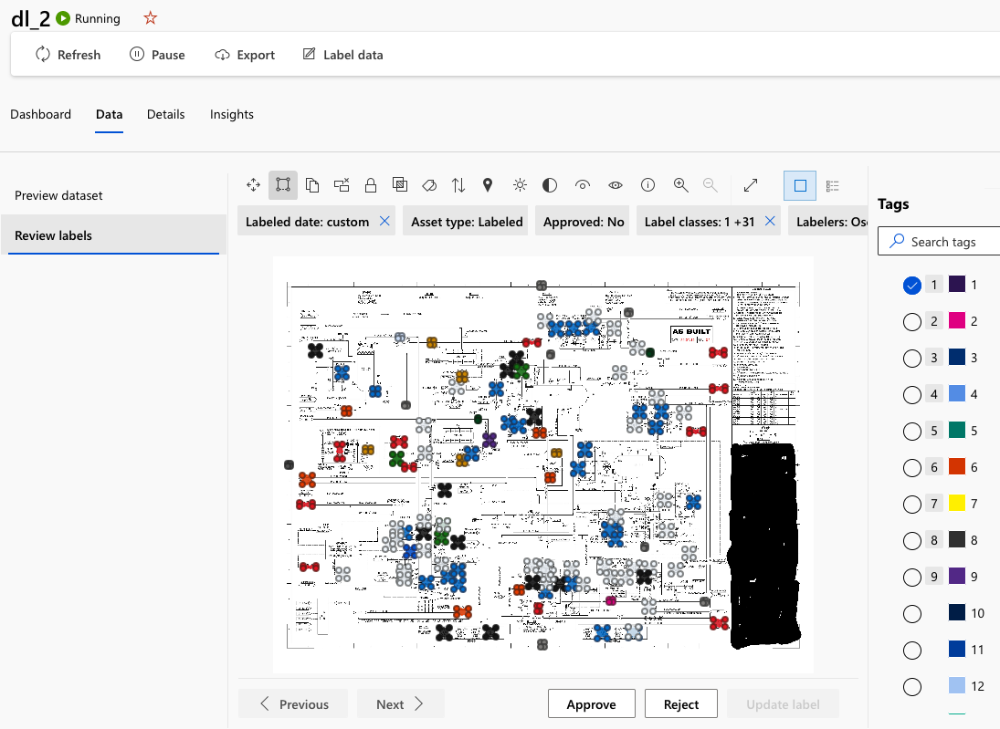

# Manual Feedback Loop  <!-- omit from toc -->

This document outlines the process to incorporate new P&IDs, along with their labels, into the training loop using
Azure Machine Learning (AML) Data Labelling Tool.

## Table of contents

- [Table of contents](#table-of-contents)
- [Sequence of Steps](#sequence-of-steps)
  - [Prepare the P\&ID image dataset](#prepare-the-pid-image-dataset)
  - [Prepare the P\&ID label dataset](#prepare-the-pid-label-dataset)
  - [Import labeling into Azure ML](#import-labeling-into-azure-ml)
  - [Trigger the model training job](#trigger-the-model-training-job)
  - [Deploying the trained model](#deploying-the-trained-model)

## Sequence of Steps

### Prepare the P&ID image dataset

1. Download all P&ID images from the inference results Blob Storage. In the Blob Storage account,
the location of the results for the unique `pid_id` of an inference run is `inference-results/<pid_id>/symbol-detection/<pid_id>.png`

    

1. Upload the downloaded P&ID images into the training images Blob Storage that Azure ML recognizes as a
[datastore](https://learn.microsoft.com/en-us/azure/machine-learning/concept-data?view=azureml-api-2#datastore) (i.e.
`workspaceblobstore` is a default registered data store linked to a blob storage).
    Upload the downloaded P&ID into the same corpus of images as the synthetic images.
    These images are under the `workspaceblobstore` [datastore](https://learn.microsoft.com/en-us/azure/machine-learning/concept-data?view=azureml-api-2#datastore).
    Under this datastore, the images are located under `pid/data/images`.

1. Upload the images again under `workspaceblobstore/Labeling/datasets/images/images_<batch_number>`.
    This path will be used when registering a new image folder dataset.

1. Register a new dataset for the P&ID images. Go to Azure ML Studio > Assets > Data to create a new data asset.

    Key points:

    - Set the dataset name under the naming convention, for instance, `dl_images_<batch_number>`
    - Select `File` under `Dataset Types (from Azure ML v1 APIs)` as data asset type.
    - Ensure to select "From Azure storage" as source
    - Select the same datastore used in the previous step.
    - Browser or enter manually the path used in the previous step, `Labeling/datasets/images/images_<batch_number>`

    To illustrate the creation steps, here is the workflow:

    

    

    

    

    

### Prepare the P&ID label dataset

1. Download the symbol detection annotations from the inference results Blob Storage. Once accessing to the
Blob Storage container, look for:

    1. (recommended) `inference-results/<pid_id>/text-detection/request.json` to get the latest symbol detection results (if it has been
       provided), or
    2. `inference-results/<pid_id>/symbol-detection/response.json` to get the original symbol detection results

    

1. Put the downloaded files in `/src/tools/label_project_initializer/annotations`

1. Run the program [/src/tools/label_project_initializer/main.py](../src/tools/label_project_initializer/main.py) to
consolidate the corrected symbol detection labels into a single JSONL file and register a new dataset for the P&ID labels.
It is recommended to run the program from `/src` either in a virtual environment or the dev container.
For more information on setting up the local environment, view [this document](./local_development_setup.md)

    Sample command:

    ```bash
    python -m tools.label_project_initializer.main \
        --dataset-name dl_labels_<batch_number> \
        --images-relative-path Labeling/datasets/images/images_<batch_number> \
        --input-data-path ./tools/label_project_initializer/annotations \
        --labels-blob-storage-path Labeling/datasets/labels/labels_<batch_number> \
        --all-labels-path ./tools/label_project_initializer/labels/<label_file>.json
    ```

    **NOTE 1:** This program will not work on the Apple silicon chips as the dataset is registered using the AML V1 sdk.
    Due to this, we have excluded the package from `requirements.txt`. As a [workaround](./local_development_setup.md#running-issues-for-mac-m1m2-users), you can create a Jupiter Notebook, upload
    and run the script from there.

    **NOTE 2:** Ensure you implement the `.env` config settings to authenticate into Azure (see `.sample.env`)

    **NOTE 3:** The `images-relative-path` is the blob storage path of the image dataset. We recommend to copy the
    relative path field from new "Image Dataset" overview page done in the previous step.

    

    More information on the label script can be found [here](../src/tools/README.md#label-project-initializer).

### Import labeling into Azure ML

1. Create a new data labeling project. Go to Azure ML Studio > Manage > Data Labeling.

    Key points:

    - Select `Image` as media type and `Object Identification (Bounding Box)` as labeling task type.
    - Select the image dataset created in the previous section and enable the setting "importing from labeled dataset"
    - Select the label dataset created in the previous section. For import, we recommend to select `As Pre-labeled tasks` to
      validate/update the labels in the P&ID images.
    - Review the label categories.
    - Disable ML assisted labeling

    To illustrate the creation steps, here is the workflow:

    

    

    

    

    

1. Once the data label project is created, go to the overview page and select `Label data` in the header.
   Add bounding boxes around images that are not tagged and update any incorrect boudning boxes.
   Once the P&ID is ready to go, press `Submit` and repeat with the other P&IDs

    

    

1. Perform P&ID data labeling review. Go to the data label project overview again, go to `Data` overview, select `Review labels`.
In this section, confirm if labeling looks "good". If yes, approve the revision.

    

1. Export labeling data. Access to the data label project and go to `Export` overview. Ensure to select `Azure ML dataset` as
format and check `Only approved` option.

    

1. Access to the exported labeling job and download the exported labeling data from the Blob Storage.

    

    

1. Upload the downloaded labels to the `workspaceblobstore` data asset under the folder `pid/data/labels`

### Trigger the model training job

After the new training data is incorporated into the rest of the training data,
the MLOPS pipeline must be run to train a new model on the data.
To do this, run the command below:

```bash
# working directory = /src/app
python -m main
```

**NOTE:** ensure your `.env` file is up to date and has a valid path to data in AML.

You should see a pipeline job similar to the following:


**NOTE:** to learn more about the MLOPS pipelines steps, such as training, registration and tagging of the model;
go [here](./aml_pipeline_modules.md#aml-pipeline-steps)

### Deploying the trained model

If you would like to leverage the newly trained model, deploy the model to an online endpoint.
For more information on deploying models to on online endpoint, follow [this document](./online_endpoint_deployment.md).