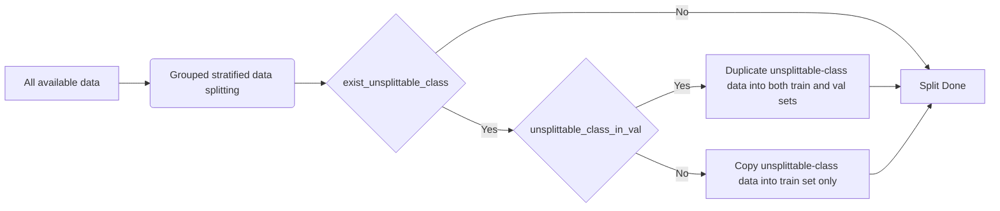
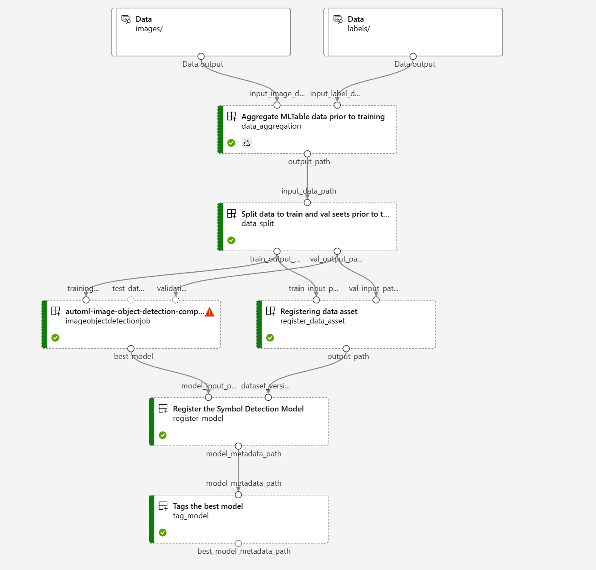

# Stratified Data Splitting Design

## Motivation

Current implementation in automl only support random splitting which may results in uneven class level distribution and lead to biased model evaluation. By creating stratified splitted training and validation set to guaranteed good representation of all label classes, we are able to compare models across different iterations or experiments in a fair and reliable manner.

## Methodology

Train_test_split from sckit-learn is commonly used for data splitting for various modeling tasks. However, train_test_split fails to meet the distinctive demands of stratified splitting in object detection, which differ from the requirements of conventional stratified data splitting. As object detection contains multi-labels in single data instance, the stratification requires balanced class distribution for split datasets, while there are no overlap of files among all the split datasets. `StratifiedGroupKFold` from `sklearn.model_selection` ([docs]( https://scikit-learn.org/stable/modules/generated/sklearn.model_selection.StratifiedGroupKFold.html)) are used for this purpose. It returns stratified folds with non-overlapping groups (i.e., file). The folds are made by preserving the percentage of samples for each class.

The generic flows for data splitter implemented can be described by the flow chart below:

> ** unsplittable_class refers to rare classes (number of images with the class is less then the `k`) which can not be split by the splitting method
> 
> *** Due to the limited dataset in the project (approximately 500 images), the `k` is set to be `5-folded` based on common practice for small dataset in ML; the value of `k` is configurable in `.env` as `STRATIFIED_SPLIT_N_FOLD`. Although we are utilizing K fold cross validation for stratified splitting, only a single fold is utilized in the rest of the pipeline.

### Consideration on unsplittable_class_in_val

In the current dataset, there are some rarely symbol types (e.g., equipments) which will be failed for stratified splitting. Decision should be made for whether (1) rare classes should add to both train and val set (i.e., `unsplittable_class_in_val=True`) or (2) rare classes should add to train only ((i.e., `unsplittable_class_in_val=False`)).

There are pros and cons for approach (1) and approach (2):

Including (1) rare classes to both train and val provides a more complete report on all symbol types, with potentially biased reported performance for rare classes
Including (2) rare classes should add to train only provides a more reliable performance estimation wherein there is no metrics reported for critical but rare types.

Through discussion, we decided to take approach (1) to include rare classes to both train and val set. Metrics will be reported per class. As rare classes will be recorded during the datasets are created, the metrics for rare classes will be potentially over-estimated due to the overfitting. The overfitting will be eventually resolved while more data is available to conduct a valid train-val splitting.

## Pipeline Integration

Data splitting has been integrated with automl training pipeline as illustrated below:

In the pipeline, data splitter splits the data from aggreation step into train and validation dataset. The two datasets will be utilized during the training phase to train the model. The splitted datasets will be logged within the Azure ML workspace to enable tracking and the possibility of future reuse.