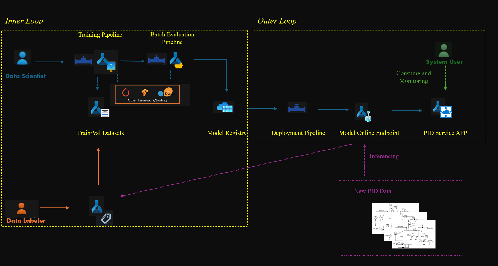

# Workflow Overview for Symbol Detection

The diagram below illustrates the key workflows for iterative model life cycle for symbol detection of this P&ID digitalization.

The key development steps can be de summarized as follows:

1. Data scientists train the object detection module using [training pipeline](./aml_pipeline_modules.md)
1. Data scientists fine tunes the best model obtained from training pipeline for batch evaluation pipeline and register the best model with model registry
1. The best model is deployed to [online endpoint](./online_endpoint_deployment.md) which can be integrated with other P&ID digitalization systems and consumable by end users
1. When additional PID data is available for training, model endpoint will be used to obtained the initial labels, which will be validated and refined by the data labelers (i.e. [manual feedback loop](./manual-feedback-loop-design.md))
1. After the new PID data is exported to AML data assets, data scientist improve the model by executing the training pipeline with new dataset registered
